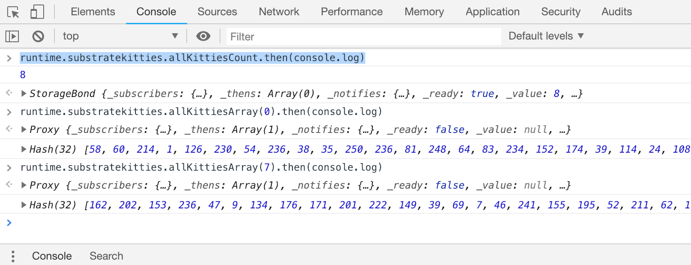

SubstrateUIを探求する
===

Substrate UIは、内部で様々なことが行われています。いくつかの概念を単純化して、UIのカスタマイズを開始できるように説明します。

## Substrate UIの骨子

`substrate-ui`テンプレートには、一般的なブロックチェーンアプリUIが持っているであろう機能をいくつか備えています：

 - キー+アカウントを管理および作成するためのウォレット
 - アカウントに関する詳細を取得するためのアドレス帳
 - 口座間で送金するための転送機能
 - ランタイムを簡単にアップデートするためのランタイムアップグレードUX
 - キー/バリューのストレージの変更UX
 - カスタムトランザクション送信者

## Reactコンポーネント

Substrate UIのコードを見てみれば、それぞれの目的を持ったReactコンポーネントで構成されていることに気づくはずです。すでに述べたように、Substrate UIには事前に構築された機能が含まれています。これにさらなる機能を追加したいなら、他のコンポーネントは`src`フォルダで見つかります。

これらすべてのコンポーネントは `src/app.jsx`ファイルにまとめられています。これらはUI作成に非常に役に立つでしょう。

## ランタイムを読む

Substrate UIを介してブロックチェーンにアクセスできます。一番すごいのは、あなたが作成した新しいモジュールが既にUIに認識されていることです。それではSubstrate UIの機能などいくつか見てみましょう。

これからは、ブラウザのコンソールで作業し、オートコンプリート機能を使用します。これにはブラウザ上で`F12`を押すか`Inspect Element`モードに入ることでアクセスできます。

コンソールで以下を入力すると（最後のドットに注意してください）：

```
runtime.
```

ブラウザが認識しているオートコンプリートオプションのリストが表示されます。

リストを見てみるとそれらが私たちのRuntimeのモジュールであることに気づくでしょう！そしてそこには`substratekitties`があります！もっと深く見てみましょう：

```
runtime.substratekitties.
```


ここでは選択したモジュール内の全てのストレージアイテムを見ることができます。そのうちの一つをみてみましょう：



```javascript
> runtime.substratekitties.allKittiesCount.then(console.log)

8

> runtime.substratekitties.allKittiesArray(0).then(console.log)

Hash(32) [58, 60, 214, 1, 126, 230, 54, 236, 38, 35, 250, 236, 81, 248, 64, 83, 234, 152, 174, 39, 114, 24, 108, 34, 128, 61, 74, 136, 74, 38, 206, 48]

> runtime.substratekitties.allKittiesArray(7).then(console.log)

Hash(32) [162, 202, 153, 236, 47, 9, 134, 176, 171, 201, 222, 149, 39, 69, 7, 46, 241, 155, 195, 52, 211, 62, 170, 24, 130, 50, 252, 36, 126, 209, 153, 38]
```

このランタイム例には8つのキティがあり、そのすべてに `allKittiesArray`からアクセスできることがわかります。 （この要素は0から255の32要素を持つ `kitty_id`ハッシュです（32要素* 8ビット= 256ビットハッシュ））。

## Substrate UIでのRuntime変数の使用

まずはページに現在のキティの数を含めるようにSubstrate UIを更新してみます。

上に示した変数はRuntimeと連携しています。つまり、ブロックチェーンに変更が加えられると、それらの値は自動的に更新されます。これはまた、通常とは異なる方法で変数を操作する必要があることも意味します（上記の例ではJavaScript Promiseを使用したことに注意してください）。

この例では、すでに構築されているコンポーネントを使用します。この場合は、ほとんどすべてのRuntimeコールを読みやすい文字列に変換する、「Pretty」という名前のコンポーネントを使用します。

この例では：

```
<Pretty value={runtime.substratekitties.allKittiesCount}/>
```

が以下に変換されます:

```
<span>8</span>
```

さらに、`allKittiesCount`の値が変わると、HTMLは自動的に更新されて最新の値を表します。これは、コンポーネントの内容を自動的に再レン​​ダリングするReactステートのおかげです。

## あなたの番です！

テンプレートには、現在、`Subheader`があります：

```javascript
<Header.Subheader>There are 0 kitties purring.</Header.Subheader>
```

ランタイムで追跡されているキティの現在の数を表すように `0`の値を更新します。次に、Polkadot UIを使用してキティをいくつか追加し、値が自動的に更新されることを確認します。

<!-- tabs:start -->

#### ** Template **

[embedded-code](../../4/assets/4.2-template.js ':include :type=code embed-template')

#### ** Solution **

[embedded-code-final](../../4/assets/4.2-finished-code.js ':include :type=code embed-final')

<!-- tabs:end -->