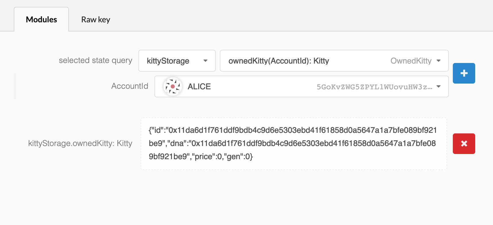

# 查看 Structure

现在我们已经构建了 runtime 来制作 kitty，现在需要检查一下我们的工作！

我们已经为我们的链引入了一个自定义结构，虽然 Polkadot-JS Apps UI 非常善于适应我们的变化，但在这种情况下，我们需要给出一个关于如何反序列化结构体数据的提示。

> 提示：请记住重置你的链，以便在与 UI 交互时重新开始：
>
> ```bash
> ./build.sh
> cargo build --release
> ./target/release/substratekitties purge-chain --dev
> ./target/release/substratekitties --dev
> ```

## 注册一个自定义 Struct

幸运的是，Polkadot-JS Apps UI 为我们提供了一种非常简单的方法来导入自定义结构，以便页面能够正确解码信息。

在 **Settings** tab 页面的 **developer** 部分，有一个输入区域，你可以在其中提交 JSON 文件。将此 JSON 对象保存到一个 `.json` 文件中，并将该文件提交到 Polkadot-JS Apps UI 中。

```json
{
    "Kitty": {
        "id": "H256",
        "dna": "H256",
        "price": "Balance",
        "gen": "u64"
    }
}
```

最后按下 `Save & Reload`。

## 创建一个 Kitty

现在我们可以去创造一个新的 kitty。在 **Extrinsics** tab 页面中，进入：

```
substratekitties > createKitty()
```

按下提交后，你应该看到交易完成：


## 查看 Kitty

最后，我们可以进入 **Chain State** tab 页面，查看我们存储的 kitty 对象。选择：

```
kittyStorage > ownedKitty(AccountId): Kitty
```

接着选择已调用 `createKitty()` 函数的用户。然后，你应该能够看到 `Kitty` 对象的各个属性：



---

**Learn More**

谈论序列化和反序列化。

我们如何简单地传输原始字节

[TODO: make this a page]
