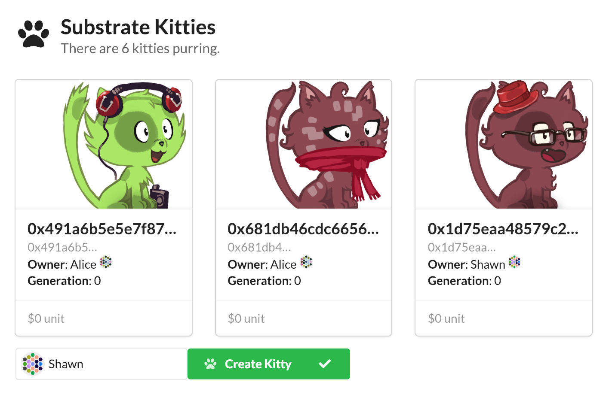

# 渲染 Kitties

如果你做到这一部分了，那么你即将真正完成我们本节中要做的事情：在我们的 UI 中添加 kitty。

## 添加我们定制的 `KittyCard` 组件

我们已经构建了一个自定义的 React 组件来显示小猫。它并不复杂，但就本教程而言，我们不会让你构建它。你可以在 [此处](https://github.com/shawntabrizi/substrate-collectables-workshop/raw/master/4/assets/KittyCards.zip) 下载 `.zip` 组件。

要添加它，你必须将 `KittyCards` 文件夹放在 `src` 文件夹中：

```
substratekitties-ui/
|
+-- src/
    |
    +-- KittyCards/      <-- Place here
    |
    +-- AccountIdBond.jsx
    |
    +-- ...
```

然后，在 `app.jsx` 文件中，你需要导入此组件：

```javascript
import { KittyCards } from './KittyCards';
```

这将使你可以访问 `<KittyCards>` 组件：

```javascript
<KittyCards count={runtime.substratekitties.allKittiesCount} />
```

### 添加 `Kitty` 类型

在此组件工作之前，我们需要告诉 Substrate UI 我们的自定义 `Kitty` 类型。我们可以使用 oo7 JavaScript 库提供的 `addCodecTransform()` 函数来实现这一点。

对于我们的 kitty 对象，它看起来像这样：

```javascript
addCodecTransform('Kitty<Hash,Balance>', {
    id: 'Hash',
    dna: 'Hash',
    price: 'Balance',
    gen: 'u64'
});
```

我们可以将它添加到我们应用程序的 `constructor()` 函数中，以确保它在开始时被加载。在此之后，我们可以像任何其他 JSON 对象一样与 `Kitty` 对象的属性进行交互。

> 注意： 编解码器转换使用键/值对来查找应该用于反序列化的对象结构。因此，让你的 “object name” 与预期完全匹配是非常重要的。在这种情况下，请注意对象名称 `Kitty<Hash,Balance>` 中没有空格。如果 Substrate UI 无法找到自定义对象的正确密钥，它将在浏览器控制台中显示一个错误，其中包含预期的确切对象名称。

## 深入我们的自定义组件

由于我们不会为你构建此组件，因此作为替代我们将向你展示一些工作组件。



### 动态卡片导入

让我们快速浏览 `/KittyCards/index.jsx` 的各个部分，以展示当把 kitty 添加到系统时我们如何动态加载新的卡片。

我们从 UI 调用 `KittyCard` 组件：

```javascript
<KittyCards count={runtime.substratekitties.allKittiesCount} />
```

此组件绑定在 `allKittiesCount` bond 上，随着区块链状态的更改，它将自动更新。

当 `allKittiesCount` 改变时，我们的 `KittyCards` 组件的 `readyRender()` 部分被触发，它抓取最新的计数，并遍历 `allKittiesArray()` 中的每个项目，这将返回唯一的 kitty id `Hash`。

```javascript
    readyRender() {
        let kitties = [];

        for (var i=0; i < this.state.count; i++){
            kitties.push(
                <div className="column" key={i}>
                    <KittyWrap hash={runtime.substratekitties.allKittiesArray(i)} />
                </div>
            );
        }
```

然后将 kitty id `Hash` 发送到 `KittyWrap` 组件，该组件对所有者和 Kitty 对象进行简单查找。如果发送给 `KittyWrap` 的 `hash` 在循环中没有变化，那么 React 将跳过重新渲染过程。

```javascript
class KittyWrap extends ReactiveComponent {
    constructor(props) {
        super(['hash']);
    }

    readyRender() {
        const { hash } = this.state; // Object destructuring assignment syntax
        return (
            <KittyCard
                kitty={runtime.substratekitties.kitties(hash)}
                owner={runtime.substratekitties.kittyOwner(hash)}
            />
        );
    }
}
```

最后，`KittyWrap` 调用 `KittyCard`，用于实际生成每张卡内容。

请注意，我们使用 JavaScript [Object Destructuring Assignment Syntax]((https://developer.mozilla.org/en-US/docs/Web/JavaScript/Reference/Operators/Destructuring_assignment#Object_destructuring)) 来解构 `this.state` 中的 `hash` 属性，避免重复多次编写 `this.state.hash`。

### 卡片内容

我们的 `KittyCard` 组件获取从 `KittyWrap` 传递的 `Kitty` 对象以及所有者，并格式化所有数据。从上到下为：

- Kitty ID
- Kitty DNA（与 0 代 kitties 相同）
- Kitty 所有者
- Kitty 子孙
- Kitty 价格

```javascript
<Card>
    <KittyAvatar dna={kitty.dna} />
    <Card.Content>
        <Card.Header>
            <Pretty
                value={kitty.id}
                className='limit-name'
            />
        </Card.Header>
        <Card.Meta>
            <Pretty
                value={kitty.dna}
                className='limit-dna'
            />
        </Card.Meta>
        <Rspan>
            <b>Owner</b>: {
                secretStore()
                    .find(this.state.owner)
                    .name
            }
        </Rspan>
        &nbsp;
        <Identicon
            key={this.state.owner}
            account={this.state.owner}
            size={16}
        />
        <br />
        <Rspan>
            <b>Generation</b>: {kitty.gen}
        </Rspan>
        <br />
    </Card.Content>
    <Card.Content extra>
        <Pretty
            value={kitty.price}
            prefix="$"
        />
    </Card.Content>
</Card>;
```

你可以看到我们正在使用 bond 和其他 Substrate UI 组件来进行最终渲染。

### 从 DNA 生成 Kitties

你可以看到我们的 `KittyCard` 在 `<KittyAvatar>` 组件中还有一层抽象。

如果查看 `/KittyCards/avatars/index.jsx`，你将看到最终用于管理生成 kitty 图像的 React 组件。

组件中的核心函数是 `dnaToAttributes()`：

```javascript
function dnaToAttributes(dna) {
    let attribute = (index, options) => dna[index] % options;

    return {
        body: IMAGES.body[attribute(0, 15)],
        eyes: IMAGES.eyes[attribute(1, 15)],
        accessory: IMAGES.accessories[attribute(2, 20)],
        fur: IMAGES.fur[attribute(3, 10)],
        mouth: IMAGES.mouth[attribute(4, 10)]
    };
}
```

kitty DNA 是一个字节数组（0-256），我们映射前 5 个字节来控制 kitty 的特定属性选择。你不仅可以看到每个属性拥有 256 个可配置选项，而且我们最多也可以拥有 256 个属性！

我们使用 David Revoy 的 [Cat Avatar Generator](https://framagit.org/Deevad/cat-avatar-generator/tree/master) 项目为我们的图像生成提供支持，但如果你能找到一位优秀的艺术家，那么呈现效果将是没有极限的。

## 轮到你了！

现在你已经了解了 `KittyCard` 组件的工作原理，现在可以将其集成到你的 Substrate UI 中了。这应该是没什么难的，因为 React 组件完成了所有的艰苦工作。

完成后，尝试创建一个 kitty 并观看你的 UI 更新情况！你还可以通过在另一个选项卡中的 Polkadot UI 启动交易来尝试其他 runtime 功能。

你想测试你的 React + JavaScript + Bonds 技能吗？我们只集成了 runtime 的一个函数，但是还有很多可以尝试构建的函数：

- 设定一只 kitty 的价格
- 买一只 kitty
- 显示特定所有者的 kitties
- 饲养 kitties
- 等等...

如果你引入一种从 runtime 删除 kitties 的方法，还要考虑如何更改 `KittyCards` 组件。

<!-- tabs:start -->

#### ** Template **

[embedded-code](../../4/assets/4.4-template.js ':include :type=code embed-template')

#### ** Solution **

[embedded-code-final](../../4/assets/4.4-finished-code.js ':include :type=code embed-final')

<!-- tabs:end -->
